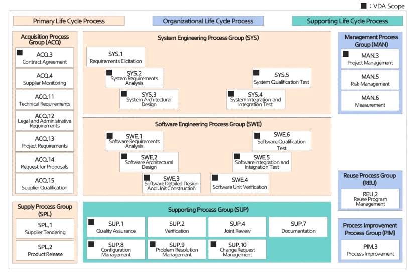

# ASPICE
MOBIUS BOOTCAMP ASPICE 학습 리포지토리

# Automotive SPICE 개요

## Automotive SPICE 개발 배경 및 소개
- 자동차의 전장화와 소프트웨어의 증가
    - 자동차에서 제조원가 중 전장 부품의 비중이 50%까지 증가했음
    - 시간이 지날수록 점차 늘어남
- 자동차 소프트웨어의 대형화
    - 자동차의 부품은 약 70-100여개의 제어기를 포함
    - 모든 제어기에 탑재된 소프트웨어는 1억 라인 이상(자율주행차는 2억 라인 이상)
- 소프트웨어의 규모 증가에 따른 품질 문제의 증가
    - 잘 만든 소프트웨어는 1000 Line 당 8-12개의 결함 존재할 수 있다고 한다.
    - 보잉 787은 1400만 LOC로 약 14만개의 결함이, 자동차는 1억 LOC로 100만 여개의 결함이 존재 가능성이 있음
- 소프트웨어 정의
    - 소프트웨어는 프로세스를 포함한 그에 관한 산출물을 포함한다.
    - 그 이유는 소프트웨어의 특징에서 알 수 있다.
        - 비가시성 : 구조가 눈에 보이지 않음
        - 비선형의 복잡한 구조
        - 마모되지 않고 계속해서 변경됨
        - 사람 중심의 작업 : 숨겨진 결함이 존재

- 프로세스의 역할
    - 프로세스는 고객의 요구사항을 만족하는 제품을 만들기 위한 절차/방법, 도구/장비, 인력을 통합시키는 역할을 함
- 프로세스의 중요성
    - 제품의 질은 제품을 개발하고 운영하는 프로세스의 질에 의해 결정된다.
    - 프로세스 품질(Process Quality) : 정의, 수행, 통제, 개선이 얼마나 잘되었는지 확인하는 속성
    - 제품 품질(Product Quality) : 산출물의 추적성과 일관성, 최종 산출물의 고객 요구사항을 만족 여부
- 프로세스 능력 수준과 품질 비용 간의 관계
    - 프로세스가 좋은 조직일수록 결함 여부를 빨리 발견함
        - 프로세스가 좋은 조직은 결함의 90%을 제품 출시 11개월 전에 발견한다면
        - 프로세스가 좋지 않은 조직은 결함의 90%을 제품 출시 2개월 전에 발견한다.
    - 프로세스 레벨이 낮으면 결함이 후반부에 발견되며 100개의 결함 당 처리비용이 올라간다.

- Automotive SPICE 개발 배경
    - 부품 업체에 대한 프로세스 품질 평가 기준 필요
        - OEM만 잘한다고 해결되는 것이 아니므로 소프트웨어 시스템을 개발하는 부품 업체들을 평가하기 위한 동일 기준이 필요
        - 자동차 분야의 특성을 반영한 프로세스 품질 평가 기준 필요
    - Audi, BMW, VW 등 유럽 OEM 업체가 연합하여 HIS(Hersteller Initiative Software) 그룹을 구성
    - ISO/IEC 12207과 ISO/IEC 330xx(기존 ISO/IEC 15504)을 기반으로 자동차 소프트웨어 시스템 개발에 특화된 프로세스 모델을 만듦
    - 현재는 VDA AMC Working Group 13과 Automotive SIG(Special Interest Group)에서 주관함
- Automotive SPICE 소개
    - Automotive Software Process Improvement and Capability dEtermination
    - 자동차 부품 업체들의 소프트웨어 프로세스를 개선하고 능력을 평가하기 위한 기준을 제시한 프로세스 모델

## Automotive SPICE 프로세스 모델 구조
- Automotive SPICE 프로세스 모델의 구성
    - 프로세스 참조 모델 > 평가 대상
    - 프로세스 평가 모델 > 평가 지표
    - 측정 프레임워크(ISO/IEC 33020을 채택) > 평가 방법(기준, 등급 등)

- 프로세스 참조 모델(Process Reference Model) PRM
    - 평가 대상 **프로세스의 범위**와 **프로세스 별 정의**에 필요한 프로세스 식별자(ID), 이름(Name), 목적(Purpose), 성과(Outcomes)를 설명한 모델
        - 예) ID : SWE. 1
        - 이름 : 소프트웨어 요구사항 분석
        - 목적 : 시스템 요구사항 중 소프트웨어와 관련 있는 부분을 소프트웨어 요구사항으로 변환함
        - 성과 : 소프트웨어 요구사항을 구현하기 위한 우선순위가 정의됨
    
    

    - 3개의 프로세스 카테고리
        - 주요 생명주기
        - 조직 생명주기
        - 지원 생명주기
    - 8개의 프로세스 그룹
        - 주요 생명주기는 4개의 프로세스 그룹
        - 조직 생명주기는 3개의 프로세스 그룹
        - 지원 생명주기는 1개의 프로세스 그룹
    - 32개의 개별 프로세스
    - 조금 더 중요한 필수 프로세스를 VDA Scope로 지정함

- 프로세스 평가 모델(Process Assessment Model) PAM
    - 프로세스 성과(outcomes)와 프로세스 속성 성과(Process Attribute Outcomes)가 심사 대상 조직의 프로젝트에 존재하는 식별하고 만족하는지를 **평가하기 위한 지표**를 정의한 모델
    - 프로세스 성과 : 프로세스 목적의 성공적 달성 시 도출되어야 하는 결과
        - 프로세스 수행지표 : 프로세스 성과의 수행 정도
    - 프로세스 속성 성과 : 프로세스 속성은 프로세스 능력 수준의 달성 정도를 평가하기 위한 프로세스의 특성으로 Goal로 비유됨
        - 프로세스 능력지표 : 프로세스 속성 성과의 달성 정도
        - 프로세스 능력 지표를 통해 프로세스 속성 성과의 달성 여부를 확인하고 이를 통해 최종적으로 프로세스 별 능력 수준을 결정
        - 능력수준 0 ~ 5단계로 나눔
    - 프로세스 평과 모델의 지표 유형
        - 프로세스 수행지표 : 프로세스 성과의 수행 정도
            - 활동 중심 평가 지표 : 기본 프랙티스(녹색 막대) > 소프트웨어 요구사항을 구조화한다.
            - 결과 중심 평가 지표 : 작업 산출물(파란색 막대) > 소프트웨어 요구사항 분석 보고서
        - 프로세스 능력지표 : 프로세스 속성 성과의 달성 정도
            - 활동 중심 평가 지표 : 일반 프랙티스 > 작업 산출물을 식별 및 문서화하고 통제한다.
            - 인프라 중심 평가 지표 : 일반 자원 > 형상 관리 시스템
    - 프로세스 수행 지표 구성 요소
        - 프로세스 식별자/이름(SWE.1 소프트웨어 요구사항 분석) > 프로세스 목적(시스템 요구사항 중 소프트웨어와 관련 있는 부분을 소프트웨어 요구사항으로 변환함) > 프로세스 성과(소프트웨어 요구사항을 구현하기 위한 우선순위가 정의됨) > 프로세스 수행지표(기본 프랙티스, 작업 산출물)
    - 프로세스 능력 지표 구성 요소
        - 능력 수준(소프트웨어 요구사항 분석, 프로세스의 능력 수준) > 프로세스 속성(작업 산출물 관리) > 프로세스 속성 성과(작업 산출물이 식별/문서화/통제 됨) > 프로세스 능력 지표(일반 프랙티스, 일반 자원)

## Automotive SPICE 프로세스 능력 수준
- 6단계의 프로세스 능력 수준(CL : Capability Level)으로 구분
    - 능력 수준 0 : 불완전한 프로세스
        - 프로세스가 수행되지 않았거나 프로세스 목적 달성에 실패함
    - 능력 수준 1 : 수행된 프로세스
        - PA 1.1 프로세스 수행
    - 능력 수준 2 : **관리된 프로세스** *최소 요구 수준*
        - PA 2.1 수행 관리
        - PA 2.2 작업 산출물 관리
    - 능력 수준 3 : 정립된 프로세스
        - PA 3.1 프로세스 정의
        - PA 3.2 프로세스 전개
    - 능력 수준 4 : 예측 가능한 프로세스
        - PA 4.1 정량적 분석
        - PA 4.2 정량적 통제
    - 능력 수준 5 : 혁신 프로세스
        - PA 5.1 프로세스 혁신
        - PA 5.2 프로세스 혁신 이행

- Automotive SPICE 능력 수준 1
    - 프로세스가 체계적이지 않더라도(주먹구구식) 수행되고 프로세스 성과가 산출물로 존재함
    - 일반 프랙티스
        - GP 1.1.1 프로세스 성과를 달성한다.
        - > 프로세스 수행지표(기본 프랙티스, 작업 산출물)를 활용하여 **프로세스 성과를 달성**해야함
    - 일반 자원
        - 프로세스의 기본 프랙티스 별 의도를 달성하기 위해 사용된 자원
    - 기본 프랙티스에 대응하는 활동을 체계적이지 않더라도 수행하고 작업 산출물을 만듦

- Automotive SPICE 능력 수준 2
    - 프로세스가 관리하에 체계적으로 수행되고 프로세스 성과가 산출물로 존재함
    - PA 2.1 수행 관리 (Performance Management)
        - 일반 프랙티스
            - GP 2.1.1 프로세스의 수행 목표를 식별한다.
            - GP 2.1.2 식별된 목표를 충족하기 위한 **프로세스 수행 계획**을 수립한다.
            - GP 2.1.3 계획 대비 프로세스의 수행을 모니터링 한다.
            - GP 2.1.4 프로세스의 수행을 조정한다.
            - GP 2.1.5 프로세스를 수행하기 위한 책임과 권한을 정의한다.
            - GP 2.1.6 계획에 따라 프로세스를 수행하기 위한 **자원을 식별하고, 준비하고, 이용 가능**하게 한다.
            - GP 2.1.7 관련된 이해 당사자 간의 인터페이스를 관리한다.
        - 일반 자원
            - 식별된 목표, 책임, 권한을 가진 인적 자원
            - 시설과 인프라 자원
            - 시간과 비용 보고를 포함한 프로젝트 계획, 관리, 통제 도구
            - 워크 플로우 관리 시스템
            - 이메일 및/또는 기타 의사소통 체계
            - 정보 및/또는 경험 저장소
            - **문제와 이슈 관리 체계**
    - PA 2.2 작업 산출물 관리 (Work Product Management)
        - 일반 프랙티스
            - GP 2.2.1 작업 산출물을 위한 **요구사항을 정의**한다.
            - GP 2.2.2 작업 산출물의 **문서화와 통제**를 위한 요구사항을 정의한다.
            - GP 2.2.3 작업 산출물을 식별하고 문서화하고 통제한다.
            - GP 2.2.4 정의된 요구사항을 만족시키기 위해 작업 산출물을 **검토하고 조정**한다.
        - 일반 자원
            - 요구사항 관리 방법/도구 세트
            - **형상 관리 시스템**
            - 문서화와 지원 도구
            - 문서 식별과 통제 절차
            - **작업 산출물 검토 방법과 경험**
            - 검토 관리 방법/도구 세트
            - 인트라넷, 엑스트라넷 및/또는 기타 통신 체계
            - 문제와 이슈 관리 체계
    - 소프트웨어 요구사항 분석 프로세스 성과를 달성하기 위한 기본 프랙티스를 관리하에 체계적으로 수행하고 이에 해당하는 작업 산출물을 만듦

- Automotive SPICE 능력 수준 3
    - 표준 프로세스를 테일러링 하여 프랙티스가 수행되고 프로세스 성과가 산출물로 존재함
    - 모든 것이 표준화되어 예측 가능한 수준이 되어야함
    - PA 3.1 프로세스 정의 (Process Definition)
        - 일반 프랙티스
            - GP 3.1.1 정의된 프로세스의 전개를 지원할 **표준 프로세스를 정의**하고, 유지한다.
            - GP 3.1.2 프로세스가 통합된 시스템으로 동작하도록 프로세스간의 순서와 상호작용이 결정된다.
            - GP 3.1.3 표준 프로세스를 수행하기 위한 **역할과 역량, 책임, 권한을 식별**한다.
            - GP 3.1.4 표준 프로세스를 수행하기 위해 요구되는 **인프라와 업무 환경을 식별**한다.
            - GP 3.1.5 표준 프로세스의 효과성과 적합성을 모니터링하기 위한 적합한 방법과 측정 항목을 결정한다.
        - 일반 자원
            - **프로세스 모델링 방법/도구**
            - **훈련 교재와 과정**
            - 자원 관리 시스템
            - 프로세스 인프라
            - 심사와 추세 분석 도구
            - 프로세스 모니터링 방법
    - PA 3.2 프로세스 전개 (Process Deployment)
        - 일반 프랙티스
            - GP 3.2.1 표준 프로세스의 사용에 대한 **고유한 상황에 따른 요구사항을 만족**하는 정의된 프로세스를 전개한다.
            - GP 3.2.2 정의된 프로세스를 수행하기 위한 **역할, 책임, 권한을 할당하고 의사소통** 한다.
            - GP 3.2.3 정의된 프로세스를 수행하는 데 필요한 역량을 확보한다.
            - GP 3.2.4 정의된 프로세스의 수행을 지원하기 위한 자원과 정보를 제공한다.
            - GP 3.2.5 정의된 프로세스의 수행을 지원하기 위한 적당한 프로세스 인프라를 제공한다.
            - GP 3.2.6 프로세스의 적합성과 효과성을 입증하기 위해 프로세스의 수행에 대한 자료를 수집하고 분석한다.
        - 일반 자원
            - 피드백 체계(고객, 직원, 기타 이해관계자)
            - **프로세스 저장소**
            - 자원 관리 시스템
            - 지식 관리 시스템
            - 문제와 변경 관리 시스템
            - 업무 환경과 인프라
            - 자료 수집 분석 시스템
            - **프로세스 평가 프레임워크**
            - 심사/검토 시스템
        - 능력 수준 2는 프로젝트 단위이지만 능력 수준 3는 조직의 표준 프로세스 위에 프로젝트가 움직임

- Automotive SPICE 능력 수준 4
    - 정량적 데이터에 기반하여 프로세스 성과가 예측되고 수행 및 관리됨
- Automotive SPICE 능력 수준 5
    - 프로세스 성과를 향상시키기 위해 정량적 데이터에 기반하여 지속적 개선을 수행함

## 프로젝트 관리 프로세스
- 프로젝트 관리란?
    - 프로젝트와 관련된 이해관계자들의 품질/비용/일정 측면의 요구사항을 만족시키기 위해 지식, 기법, 도구 등을 적용하여 관련 활동들을 계획하고 통제하는 프로세스
- 프로젝트 관리 프로세스 예시
    1. 프로젝트 계획 : 프로젝트 산정, 프로젝트 관리 계획 수립
    2. 프로젝트 수행 : 프로젝트 모니터링 및 통제, 단계 말 검토 및 시정조치
    3. 프로젝트 완료 : 프로젝트 완료 및 보고

- 프로젝트의 요구사항과 제약사항을 만족하는 제품을 개발하기 위해 필요한 개발/관리/지원 등의 활동과 일정/비용/공수 등을 계획하고 통제함

- 프로젝트 관리의 7가지 성과
    1. 작업의 범위
    2. 프로젝트 달성의 타당성 평가
    3. 활동과 자원산정
    4. 프로젝트 내외부 인터페이스 식별 모니터링
    5. 계획 수립 및 관리
    6. 진행현황 모니터링 및 보고
    7. 시정조치 및 문제의 재발 방지
- 프로세스 활동 지표 : Base Practices
    - BP 1~8 : 계획 수립, BP 4~10 : 모니터링 및 통제
    - BP 1 : Define the scope of work. [작업의 범위를 정의한다.]
        - 설명
            - 프로젝트 범위는 WBS(Work Breakdown Structure)로 관리한다.
            - 프로젝트의 범위는 프로젝트 수행 배경과 Business Needs를 포함하며, 프로젝트 목표(품질,일정, 비용 등)는 측정할 수 있는 정량화된 기준으로 정의한다.
            - 개발 중에 프로젝트 범위가 변경되는 경우, SUP.10 Change Request Management를 통해 관리한다.
        - Output Work Product(출력 결과물)
            - Project plan
            - Scope : 구체화된 특징과 기능을 가진 제품, 서비스 또는 결과를 인도하기 위해 수행해야 하는 업무
            - WBS(Work Breakdown Structure
                - 프로젝트 목표를 달성하고 범위를 관리하기 위하여 필요한 작업을 분할한 계층 구조 체계
                - Work Package는 WBS의 최하위 노드를 말함(2주 이내로 세분화)
            - 한 번에 전체 계획을 동일 수준으로 자세히 수립하기 보다는 단계 별로 나눠 가면서 계획을 상세화 하는 방식
        - Practice Checklist
            - 프로젝트 목표로 무엇을 도출하고 있는가?
            - 프로젝트 범위를 어떻게 정의 및 관리하고 있는가?
    - BP 2 : Define project life cycle. [프로젝트 생명주기를 정의한다.]
        - 설명
            - 소프트웨어 시스템을 개발하고 관리하는 전체 활동에 대하여 **프로젝트의 특성을 반영한 단계별 수행 전략**을 수립한다.
                - 범위, 복잡도 등의프로젝트 특성을 고려하여 적용할 생명주기 모델을 선정한다.
                - 선정한 생명주기 모델의 단계, 활동, 마일스톤 등을프로젝트 특성에 맞게조정한다.
                - 프로젝트 단계별 진행상황을 파악하는 기준선으로 마일스톤을 정의한다.
            - **고객의 개발 프로세스와 일관성**을 확보하여 생명주기 모델을 정의한다.
            - 자동차 도메인에서 적용 가능한 생명주기는 모델로 **Incremental Iterative V-Model**이 있다.
        - Output Work Product(출력 결과물)
            - Review record
            - 생명주기 모델 유형
                - 폭포수 모델, 프로토타입 모델, 나선형 모델, V 모델
        - Practice Checklist
            - 프로젝트에서 어떠한 생명주기를 정의해서 사용하고 있는가?
            - 해당 생명주기 모델을 프로젝트에서 선정한 이유는 무엇인가?
    - BP 3 : Evaluate feasibility of the project. [프로젝트의 타당성을 평가한다.]
        - 설명
            - 프로젝트의 목표를 달성하기 위해서 **프로젝트의 실행 가능성**을 평가한다.
                - 프로젝트 각단계의 작업에 대해서 일정, 공수, 비용, 가용자원 산정
                - 타당성 검토를 통해 **리스크를 식별**하고 리스크 관리대장에 기록및관리함
                - 주기적으로 공수와 비용을 재산정하고 이를다시 프로젝트 계획에 반영
        - Output Work Product(출력 결과물)
            - Review record
        - Practice Checklist
            - 프로젝트 목표를 달성하기 위해서 필요한 시간, 공수, 비용, 자원에 대해 검토 활동을 하는가?
            - 타당성 검토를 통해 어떠한 프로젝트의 리스크를 식별하였고 대응 계획을 수립하는가?
    - BP 4 : Define, monitor and adjust project activities. [프로젝트 활동을 정의하고, 모니터링하고, 조정한다.]
        - 설명
            - **프로젝트 활동(개발, 관리, 지원)을 관리 가능한 수준**으로 상세하게 WBS 등에 정의한다.
            - 개발 활동 외에 **프로젝트 관리, 변경 요청 관리, 문제점 관리** 등의 관리/지원 활동에 대해서도 WBS 등에 정의한다.
            - 프로젝트 활동들의 **의존성**을 식별하고 WBS 등에 정의한다.
        - Output Work Product(출력 결과물)
            - Project plan
            - Schedule
            - Work breakdown structure
            - Change request
            - Review record
            - Corrective action register
        - Practice Checklist
            - WBS의 활동들은 관리 가능한 수준으로 분해되어 있는가?
            - 프로젝트의 개발/관리/지원 활동을 WBS에 정의하여 관리하고 있는가?
            - 프로젝트 활동들의 의존성을 어떻게 정의하는가?
            - 프로젝트 활동을 어떻게 모니터링 하고 조정하는가?
    - BP 5 : Define, monitor and adjust project estimates and resources. [프로젝트 산정치와 자원을 정의하고, 모니터링하고, 조정한다.]
        - 설명
            - 프로젝트 공수와 자원을 산정하기 위한 방법과 기준을 정의한다.
            - 프로젝트의 목표를 달성하기 위해 필요한 **인적, 물적 자원**에 대한 투입 및 관리 계획을 수립한다.
                - 엔지니어링 환경 및도구 : 시작품 제작도구, 테스트 도구, 통합도구, 조립도구등
                - 설비 및 장치: 테스트 벤치, 기록 장치등
        - Output Work Product(출력 결과물)
            - Project plan
            - Schedule
            - Work breakdown structure
            - Change request
            - Review record
            - Corrective action register
        - Practice Checklist
            - 프로젝트 목표를 달성하기 위해서 필요한 시간, 공수, 비용, 자원에 대해 검토 활동을 하는가?
            - 타당성 검토를 통해 어떠한 프로젝트의 리스크를 식별하였고 대응 계획을 수립하는가?
        - 산정 개요
            - 산정은 미래에 수행할 작업을 이해하고 규모, 공수, 일정, 비용 등을 예상하는 활
            - **산정은 예상이므로 불확실한 부분이 있으므로 리스크를 고려해야함**
            - 성공적인 산정을 위해서는 과거 데이터를 활용해야 하고 여러 전문가들이 합의해야 함
        - 산정 절차
            - 일반적으로 규모, 공수, 일정, 비용 순으로 산정함
            - **산정 시 가정 사항(예: 공수 산정 기준, 발생 가능한 리스크 등)을 기록함**
        - 산정 방법
            - 경험적 방법 : 여러 전문가들의 기존 경험을 기반으로 산정 (예) 델파이(Delphi) 기법
            - 크기 중심 방법 : 소스 코드 라인수를 기반으로 산정 (예) LOC(Lines Of Code) 기법
            - 기능 중심 방법 : 사용자가 요구하는 기능 분석 결과를 기반으로 산정 (예) 기능 점수(Function Point) 기법
            - 과거 데이터 기반 산정 방법
    - BP 6 : Ensure required skills, knowledge, and experience. [필요 기술, 지식, 경험을 보장한다.]
        - 설명
            - 프로젝트 수행에 필요한 **필요 기술, 지식, 경험을 식별 및 필요한 수준을 정의**하고 프로젝트 인원과의 수준 비교를 통해 **부족한 부분을 획득하기 위한 방안과 시점** 등을 계획한다.
            - 프로젝트 수행에 필요한 기술, 지식, 경험 간의 차이를 분석하고 확보하는 활동을 **지속적으로** 수행한다
        - Output Work Product(출력 결과물)
            - Project plan
            - Schedule
            - Work breakdown structure
            - Change request
            - Review record
            - Corrective action register
        - Practice Checklist
            - 프로젝트 차원에서 필요한 교육대상과 교육과정을 식별하고 해당 교육을 수행하고 있는가?
            - 교육 수행결과에 대한 피드백을 어떻게 관리하고 있는가?
            - 프로젝트 진행 중에 필요 기술, 지식 간의 차이를 분석하고 확보하는 활동을 지속적으로 수행하는가?
    - BP 7 : Identify, monitor and adjust project interfaces and agreed commitments.
[프로젝트 인터페이스 및 합의된 사항을 식별하고, 모니터링하고, 조정한다.]
        - 설명
            - 프로젝트 기간 동안 각 단계별 활동에 대해 **내/외부 이해관계자들을 식별**하고 **관리하기 위한 계획을 수립**한다.
                - 프로젝트 수행조직뿐만 아니라 **관련된 모든 이해관계자들**을 식별
                - 이해관계자들의 **역할과 책임, 관계, 역할별 의사소통의 범위, 내용, 방법** 등을결정
                - 이해관계자들이 **합의한 사항을 이행하는지 파악하기 위한통제 계획**을 수립
        - Output Work Product(출력 결과물)
            - Stakeholder groups list
            - Work breakdown structure
            - Corrective action register
            - Project plan
            - Review record
            - Project status report
            - Communication record
            - Change request
        - Practice Checklist
            - 프로젝트 단계별 내/외부 이해관계자를 파악하여 의사소통 계획을 수립하는가?
            - 의사소통 계획에 맞추어서 내/외부 이해관계자들이 참여하고 있는가?
            - 수립된 프로젝트 계획에 대해 내/외부 이해관계자들의 합의는 어떻게 하고 있는가?
    - BP 8 : Define, monitor and adjust project schedule. [프로젝트 일정을 정의하고, 모니터링하고, 조정한다.]
        - 설명
            - 프로젝트 활동에 맞추어 **일정과 자원을 할당**하고 **프로젝트의 진척사항**을 관리한다.
                - 프로젝트의 **진척율을 파악하는 기준**을 정의(예: 미착수 0%, 착수/진행 50%, 완료100%)
                - 프로젝트 잔향동안에 프로젝트의 진행상황이 프로젝트 계획과 어느정도차이를 보이는지 정기적으로 점검
                - 진척사항 검토결과는 문서화 하여이해관계자들에게 공유
        - Output Work Product(출력 결과물)
            - Project plan
            - Schedule
            - Work breakdown structure
            - Change request
            - Review record
            - Corrective action register
        - Practice Checklist
            - 프로젝트 일정 대비 진척사항을 어떻게 모니터링 하는가?
            - 어떤 주기로 프로젝트 진척사항을 모니터링 하고 있는가?
            - 진척율을 파악하는 기준은 무엇인가
    - BP 9 : Ensure consistency. [일관성을 보장한다.]
        - 설명
            - 프로젝트 **계획 요소(일정, 공수, 비용 등)가 관련 산출물과 일관성** 있는지를 확인한다.
                - 프로젝트 계획요소들과 관련 산출물 간의 **일관성을 점검하기 위한 기준**을 정의
                - 프로젝트의 목표를 달성하기 위해계획 요소들이 계획및수행되고 있는지를 관리 프로젝트의 목표, 범위, 투입 인력, 비용, 자원, 일정, 필요지식 및 기술, 관리 항목 등 프로젝트 계획요소 별 수행 결과를 요구사항을 기준으로 점검
                - 프로젝트 작업산출물이 프로젝트 계획 시수립한 활동목표와 부합하는지를 점검
        - Output Work Product(출력 결과물)
            - Review record
            - Project plan
            - Change request
            - Project status report
            - Schedule
            - Communication record
            - Corrective action register
            - Work breakdown structure
            - Stakeholder groups list
        - Practice Checklist
            - 프로젝트 계획 요소들이 일관성 있는지를 확인하는 활동을 어떻게 하고 있는가?
    - BP 10 : Review and report progress of the project. [프로젝트 진척 상황을 검토하고 보고한다.]
        - 설명
            - 정기적으로 프로젝트의 진행 상태를 기록하고 점검한다.
                - 주간/월간/마일스톤 단위의 프로젝트 상태를 기록하고 공유
            - 프로젝트의 Best Practices와 Lessons Learned를 공유한다.
            - 이슈의 재발방지 대책 수립한다.
        - Output Work Product(출력 결과물)
            - Project status report
            - Corrective action register
            - Communication record
            - Review record
            - Change request
        - Practice Checklist
            - 정기적으로 프로젝트 진척사항을 파악하고 있는가?
                - 주간보고, 월간보고, 마일스톤 검토, 프로젝트 점검회의(경영진 보고) 등
            - 프로젝트 이슈발생 시 어떻게 대응하고 있는가?
            - Escalation 체계는 어떻게 정의되어 있는가?